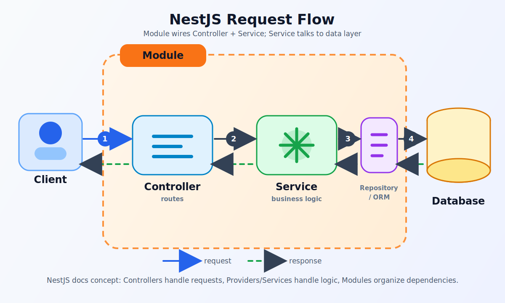
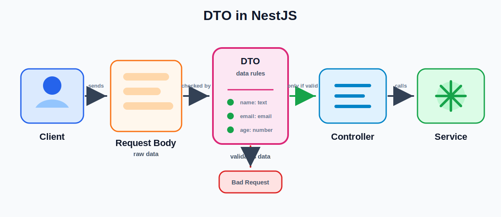
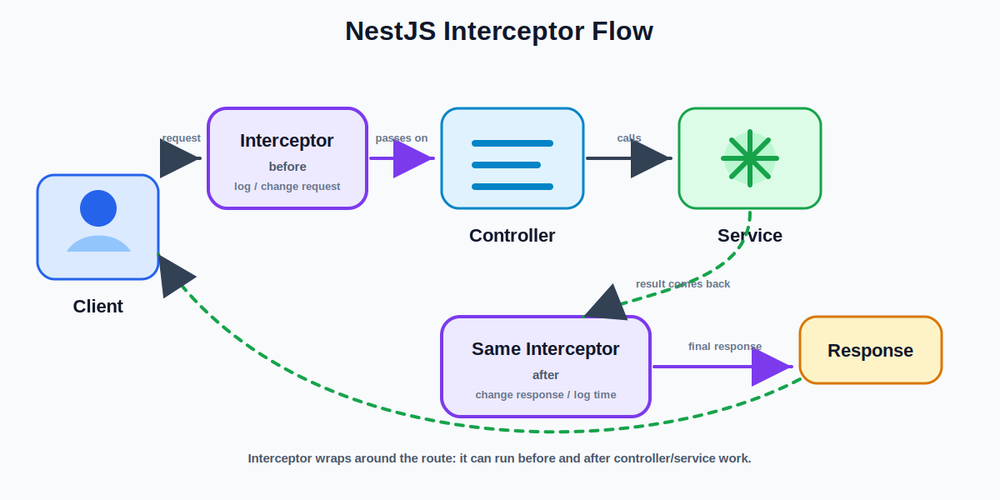

# NestJS Flow Diagram



## Simple Flow

1. The client sends a request.
2. The controller receives the request.
3. The controller calls the service.
4. The service does the main work.
5. If data is needed, the service asks the repository or ORM.
6. The repository or ORM talks to the database.
7. The database sends data back.
8. The service sends the result back to the controller.
9. The controller sends the final response to the client.

## Easy Meaning

- **Module** connects the controller and service.
- **Controller** handles the request.
- **Service** handles the work.
- **Repository / ORM** talks to the database.
- **Database** stores the data.

---

# DTO in NestJS Flow



## Simple DTO Explanation

DTO means **Data Transfer Object**.

A DTO is used when the client sends data to your app.

Example: when a user sends this:

```text
name
email
age
```

The DTO says what this data should look like.

Example:

```text
name must be text
email must be an email
age must be a number
```

If the data is wrong, NestJS can stop the request.

If the data is correct, the controller gets the data and sends it to the service.

## DTO Flow

```text
Client
  ↓
Request Body
  ↓
DTO checks the data
  ↓
Controller
  ↓
Service
```

## Remember This

- DTO is for data checking and data shape.
- DTO is not the database.
- DTO does not save data.
- DTO does not do the main work.
- Service does the main work.

---

# Interceptor in NestJS Flow



## Simple Interceptor Explanation

An interceptor sits around the controller method.

It can run **before** the controller.

It can also run **after** the controller and service finish.

Think of it like a wrapper around the request and response.

## Interceptor Flow

```text
Client
  ↓
Interceptor runs before
  ↓
Controller
  ↓
Service
  ↓
Interceptor runs after
  ↓
Response goes back to client
```

## What Can Interceptors Do?

- Log when a request starts.
- Check how long a request takes.
- Change the response before sending it back.
- Wrap response data in a common format.

## Remember This

- Controller handles the route.
- Service does the main work.
- Interceptor can run before and after them.
- Interceptor is useful for logging, timing, and changing response shape.
