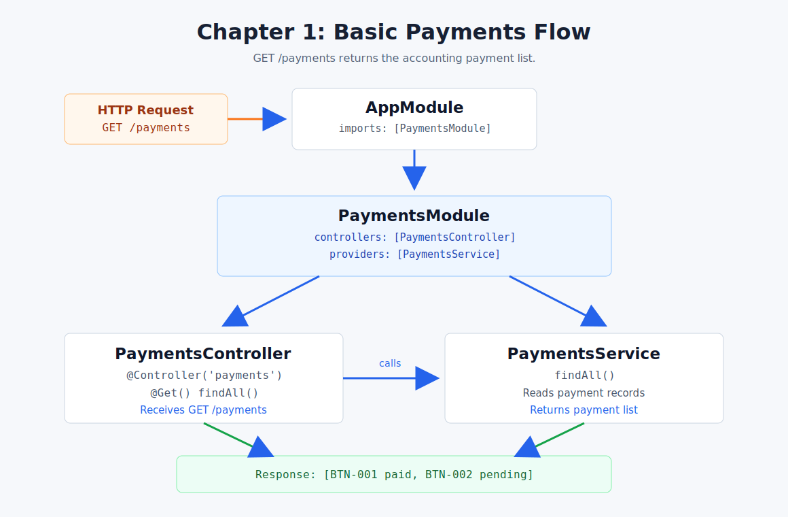

# Chapter 01 - Basic Payments Flow

[Course index](README.md) | [Next: Chapter 02](chapter-02-route-params.md)



## Goal

Create the first payment feature flow:

```text
GET /payments
  -> PaymentsController
  -> PaymentsService
  -> payment list response
```

## NestJS Concept

This chapter introduces the basic feature structure:

- A module groups related code.
- A controller receives HTTP requests.
- A service contains the main business logic.
- The controller calls the service and returns the result.

Official docs: [Controllers](https://docs.nestjs.com/controllers)

## Files

| File | Purpose |
| --- | --- |
| [`src/app.module.ts`](../../src/app.module.ts) | Imports `PaymentsModule` into the app |
| [`src/payments/payments.module.ts`](../../src/payments/payments.module.ts) | Connects the payments controller and service |
| [`src/payments/payments.controller.ts`](../../src/payments/payments.controller.ts) | Receives `GET /payments` |
| [`src/payments/payments.service.ts`](../../src/payments/payments.service.ts) | Returns the payment data |
| [`src/payments/payments.endpoints.http`](../../src/payments/payments.endpoints.http) | Stores the test request |

## Endpoint

```http
GET http://localhost:3000/payments
```

## Request Flow

```text
AppModule imports PaymentsModule
PaymentsModule connects PaymentsController + PaymentsService
PaymentsController receives GET /payments
PaymentsService returns accounting/payment data
```

## Expected Response

```json
[
  {
    "id": 1,
    "invoiceNo": "BTN-001",
    "customer": "Pema Traders",
    "amount": 1500,
    "status": "paid"
  },
  {
    "id": 2,
    "invoiceNo": "BTN-002",
    "customer": "Tashi Store",
    "amount": 2200,
    "status": "pending"
  }
]
```

## Checkpoint

You understand Chapter 01 when you can explain this sentence:

> The controller receives the route, but the service owns the payment logic.
