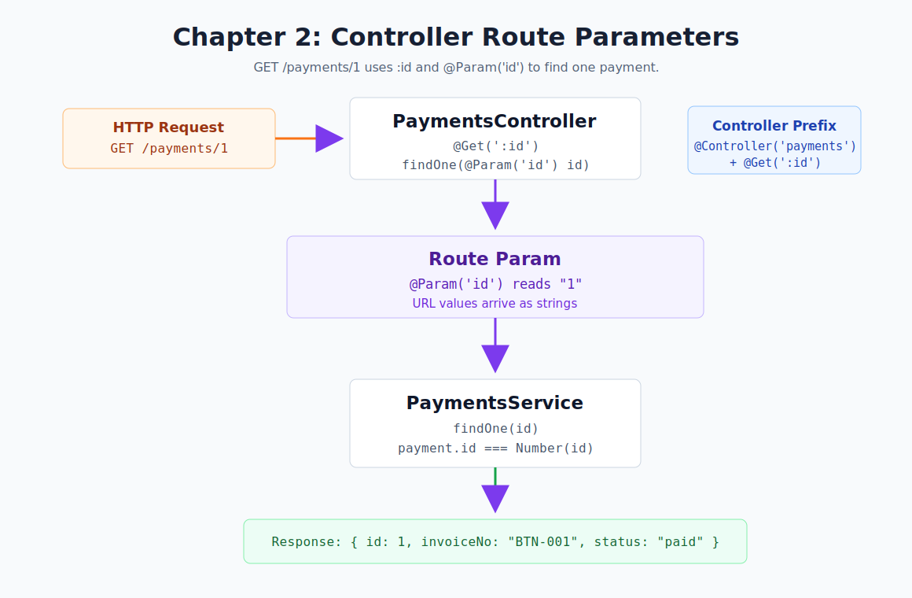

# Chapter 02 - Controller Route Parameters

[Previous: Chapter 01](chapter-01-basic-flow.md) | [Course index](README.md)



## Goal

Read an ID from the URL and return one payment record.

```text
GET /payments/1
  -> @Get(':id')
  -> @Param('id')
  -> PaymentsService.findOne("1")
  -> payment id 1 response
```

## NestJS Concept

This chapter introduces controller route parameters:

- `@Get(':id')` creates a dynamic route.
- `@Param('id')` reads the dynamic value from the URL.
- Route params arrive as strings.
- The service can convert the string into the type it needs.

Official docs: [Controllers](https://docs.nestjs.com/controllers)

## Files

| File | Purpose |
| --- | --- |
| [`src/payments/payments.controller.ts`](../../src/payments/payments.controller.ts) | Adds `GET /payments/:id` |
| [`src/payments/payments.service.ts`](../../src/payments/payments.service.ts) | Adds `findOne(id)` |
| [`src/payments/payments.endpoints.http`](../../src/payments/payments.endpoints.http) | Stores the chapter test request |

## Endpoint

```http
GET http://localhost:3000/payments/1
```

## Request Flow

```text
Client calls GET /payments/1
PaymentsController matches @Get(':id')
@Param('id') reads "1"
PaymentsService.findOne("1") runs
Number("1") becomes 1
Service returns payment id 1
```

## Expected Response

```json
{
  "id": 1,
  "invoiceNo": "BTN-001",
  "customer": "Pema Traders",
  "amount": 1500,
  "status": "paid"
}
```

## Checkpoint

You understand Chapter 02 when you can explain this sentence:

> `:id` defines a URL value, and `@Param('id')` gives that value to the controller method.
