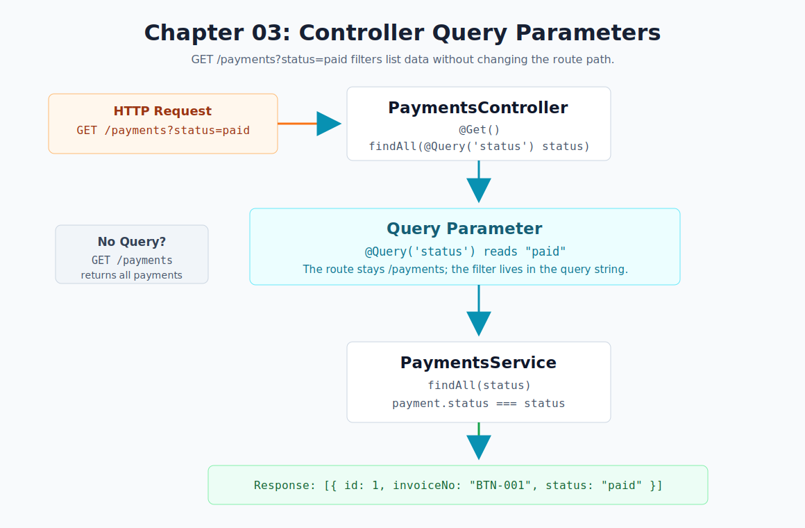

# Chapter 03 - Controller Query Parameters

[Previous: Chapter 02](chapter-02-route-params.md) | [Course index](README.md)



## Goal

Filter the payment list by status using a query parameter.

```text
GET /payments?status=paid
  -> @Query('status')
  -> PaymentsService.findAll("paid")
  -> only paid payments
```

## NestJS Concept

This chapter introduces query parameters:

- Query parameters come after `?` in a URL.
- `@Query('status')` reads the `status` value.
- Query parameters are useful for filtering list endpoints.
- If no query value is sent, the endpoint can return the full list.

Official docs: [Controllers](https://docs.nestjs.com/controllers)

## Files

| File | Purpose |
| --- | --- |
| [`src/payments/payments.controller.ts`](../../src/payments/payments.controller.ts) | Reads `status` with `@Query('status')` |
| [`src/payments/payments.service.ts`](../../src/payments/payments.service.ts) | Filters payments by status |
| [`src/payments/payments.endpoints.http`](../../src/payments/payments.endpoints.http) | Stores the chapter test requests |

## Endpoints

```http
GET http://localhost:3000/payments
GET http://localhost:3000/payments?status=paid
GET http://localhost:3000/payments?status=pending
```

## Request Flow

```text
Client calls GET /payments?status=paid
PaymentsController matches @Get()
@Query('status') reads "paid"
PaymentsService.findAll("paid") runs
Service filters payment.status === "paid"
Service returns only paid payments
```

## Expected Response

For:

```http
GET http://localhost:3000/payments?status=paid
```

Expected response:

```json
[
  {
    "id": 1,
    "invoiceNo": "BTN-001",
    "customer": "Pema Traders",
    "amount": 1500,
    "status": "paid"
  }
]
```

For:

```http
GET http://localhost:3000/payments?status=pending
```

Expected response:

```json
[
  {
    "id": 2,
    "invoiceNo": "BTN-002",
    "customer": "Tashi Store",
    "amount": 2200,
    "status": "pending"
  }
]
```

## Checkpoint

You understand Chapter 03 when you can explain this sentence:

> `@Query('status')` reads optional filter data from the URL without changing the route path.
