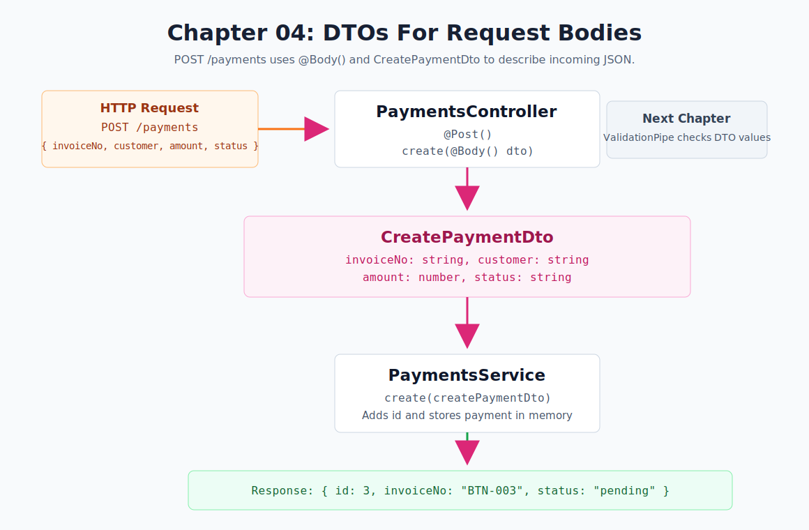

# Chapter 04 - DTOs For Request Bodies

[Previous: Chapter 03](chapter-03-query-params.md) | [Course index](README.md) | [Next: Chapter 05](chapter-05-validation-pipe.md)



## Goal

Create a new payment using a request body and a DTO.

```text
POST /payments
  -> @Body()
  -> CreatePaymentDto
  -> PaymentsService.create(createPaymentDto)
  -> created payment response
```

## NestJS Concept

This chapter introduces DTOs.

DTO means **Data Transfer Object**. In this chapter, the DTO describes the shape of the JSON data that the client sends to create a payment.

- `@Post()` creates a POST endpoint.
- `@Body()` reads the JSON request body.
- `CreatePaymentDto` describes the expected body shape.
- The controller passes the DTO to the service.
- The service creates and returns the new payment.

Official docs:

- [NestJS Controllers](https://docs.nestjs.com/controllers)
- [NestJS Validation](https://docs.nestjs.com/techniques/validation)

## Files

| File | Purpose |
| --- | --- |
| [`src/payments/dto/create-payment.dto.ts`](../../src/payments/dto/create-payment.dto.ts) | Defines the create-payment body shape |
| [`src/payments/payments.controller.ts`](../../src/payments/payments.controller.ts) | Adds `POST /payments` and reads `@Body()` |
| [`src/payments/payments.service.ts`](../../src/payments/payments.service.ts) | Adds `create(createPaymentDto)` |
| [`src/payments/payments.endpoints.http`](../../src/payments/payments.endpoints.http) | Stores the chapter test request |

## DTO

```ts
export class CreatePaymentDto {
    invoiceNo!: string;
    customer!: string;
    amount!: number;
    status!: string;
}
```

This DTO gives TypeScript a clear shape for the create-payment request.

## Endpoint

```http
POST http://localhost:3000/payments
Content-Type: application/json

{
  "invoiceNo": "BTN-003",
  "customer": "Dorji Mart",
  "amount": 3000,
  "status": "pending"
}
```

## Request Flow

```text
Client sends POST /payments
Request body contains payment data
PaymentsController reads the body with @Body()
CreatePaymentDto describes the body shape
PaymentsService.create() creates the payment
Service returns the created payment
```

## Expected Response

```json
{
  "id": 3,
  "invoiceNo": "BTN-003",
  "customer": "Dorji Mart",
  "amount": 3000,
  "status": "pending"
}
```

## Remember

```text
@Param() reads URL path values
@Query() reads query string values
@Body() reads JSON body values
DTO describes the body shape
ValidationPipe validates the DTO later
```

## Checkpoint

You understand Chapter 04 when you can explain this sentence:

> The DTO describes the request body shape, while the service decides what to do with that data.
