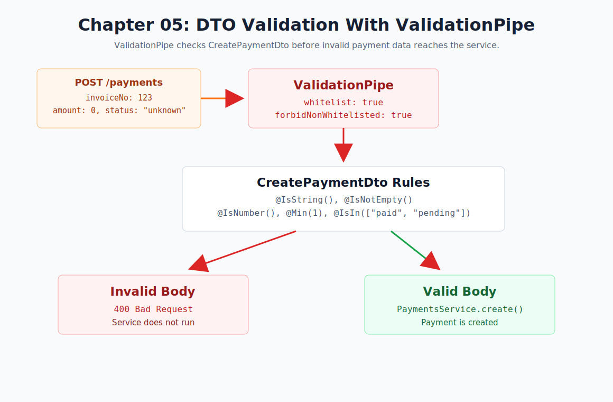

# Chapter 05 - DTO Validation With ValidationPipe

[Previous: Chapter 04](chapter-04-dtos.md) | [Course index](README.md) | [Next: Chapter 06](chapter-06-http-exceptions.md)



## Goal

Reject invalid payment request bodies before they reach the service.

```text
POST /payments
  -> ValidationPipe
  -> CreatePaymentDto validation decorators
  -> invalid body returns 400 Bad Request
  -> valid body reaches PaymentsService.create()
```

## NestJS Concept

This chapter introduces `ValidationPipe`.

NestJS validation uses `class-validator` decorators on DTO classes. The global `ValidationPipe` reads those decorators and validates incoming request bodies before the controller method continues.

Official docs: [NestJS Validation](https://docs.nestjs.com/techniques/validation)

## Files

| File | Purpose |
| --- | --- |
| [`src/main.ts`](../../src/main.ts) | Enables the global `ValidationPipe` |
| [`src/payments/dto/create-payment.dto.ts`](../../src/payments/dto/create-payment.dto.ts) | Adds DTO validation decorators |
| [`src/payments/payments.endpoints.http`](../../src/payments/payments.endpoints.http) | Stores valid and invalid request examples |
| [`package.json`](../../package.json) | Adds `class-validator` and `class-transformer` |

## ValidationPipe

```ts
app.useGlobalPipes(
  new ValidationPipe({
    whitelist: true,
    forbidNonWhitelisted: true,
  }),
);
```

Meaning:

```text
whitelist: true
  keeps only fields that exist in the DTO validation rules

forbidNonWhitelisted: true
  rejects extra fields with 400 Bad Request
```

## DTO Rules

```ts
import { IsIn, IsNotEmpty, IsNumber, IsString, Min } from 'class-validator';

export class CreatePaymentDto {
    @IsString()
    @IsNotEmpty()
    invoiceNo!: string;

    @IsString()
    @IsNotEmpty()
    customer!: string;

    @IsNumber()
    @Min(1)
    amount!: number;

    @IsString()
    @IsIn(['paid', 'pending'])
    status!: string;
}
```

## Valid Request

```http
POST http://localhost:3000/payments
Content-Type: application/json

{
  "invoiceNo": "BTN-003",
  "customer": "Dorji Mart",
  "amount": 3000,
  "status": "pending"
}
```

Expected: payment is created.

## Invalid Request

```http
POST http://localhost:3000/payments
Content-Type: application/json

{
  "invoiceNo": 123,
  "customer": "",
  "amount": 0,
  "status": "unknown",
  "extraField": "not allowed"
}
```

Expected: `400 Bad Request`.

## Request Flow

```text
Client sends POST /payments
ValidationPipe checks the request body
CreatePaymentDto validation decorators run
Invalid body stops immediately with 400 Bad Request
Valid body reaches PaymentsController
PaymentsController sends DTO to PaymentsService
PaymentsService creates the payment
```

## Checkpoint

You understand Chapter 05 when you can explain this sentence:

> The DTO declares validation rules, and `ValidationPipe` enforces those rules before business logic runs.
