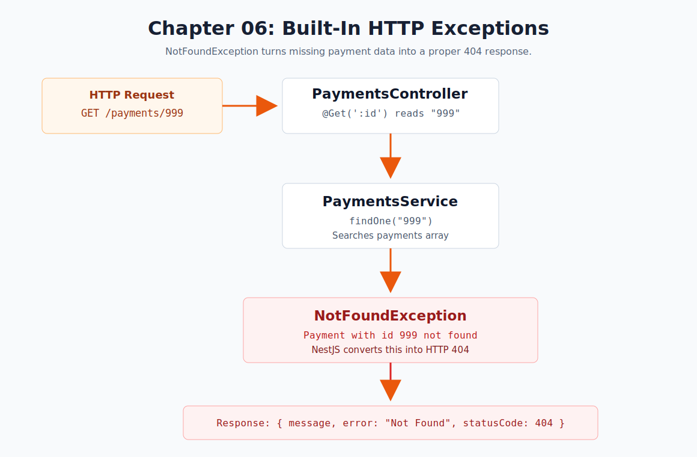

# Chapter 06 - Built-In HTTP Exceptions

[Previous: Chapter 05](chapter-05-validation-pipe.md) | [Course index](README.md)



## Goal

Return a proper `404 Not Found` response when a payment does not exist.

```text
GET /payments/999
  -> PaymentsController
  -> PaymentsService.findOne("999")
  -> no payment found
  -> throw NotFoundException
  -> NestJS returns 404 Not Found
```

## NestJS Concept

This chapter introduces built-in HTTP exceptions.

NestJS has an exception layer that converts thrown HTTP exceptions into JSON responses. For missing data, `NotFoundException` is the right built-in exception because it maps to HTTP status code `404`.

Official docs: [NestJS Exception Filters](https://docs.nestjs.com/exception-filters)

## Files

| File | Purpose |
| --- | --- |
| [`src/payments/payments.service.ts`](../../src/payments/payments.service.ts) | Throws `NotFoundException` when a payment is missing |
| [`src/payments/payments.endpoints.http`](../../src/payments/payments.endpoints.http) | Stores success and missing-record examples |

## Service Logic

```ts
public findOne(id: string) {
    const payment = this.payments.find((payment) => payment.id === Number(id));

    if (!payment) {
        throw new NotFoundException(`Payment with id ${id} not found`);
    }

    return payment;
}
```

## Existing Payment Request

```http
GET http://localhost:3000/payments/1
```

Expected response:

```json
{
  "id": 1,
  "invoiceNo": "BTN-001",
  "customer": "Pema Traders",
  "amount": 1500,
  "status": "paid"
}
```

## Missing Payment Request

```http
GET http://localhost:3000/payments/999
```

Expected response:

```json
{
  "message": "Payment with id 999 not found",
  "error": "Not Found",
  "statusCode": 404
}
```

## Request Flow

```text
Client sends GET /payments/999
Controller reads id using @Param('id')
Controller calls PaymentsService.findOne("999")
Service searches the payments array
No payment is found
Service throws NotFoundException
NestJS exception layer builds the 404 response
Client receives 404 Not Found
```

## Checkpoint

You understand Chapter 06 when you can explain this sentence:

> Missing records should not return empty success responses; they should throw a clear HTTP exception.
