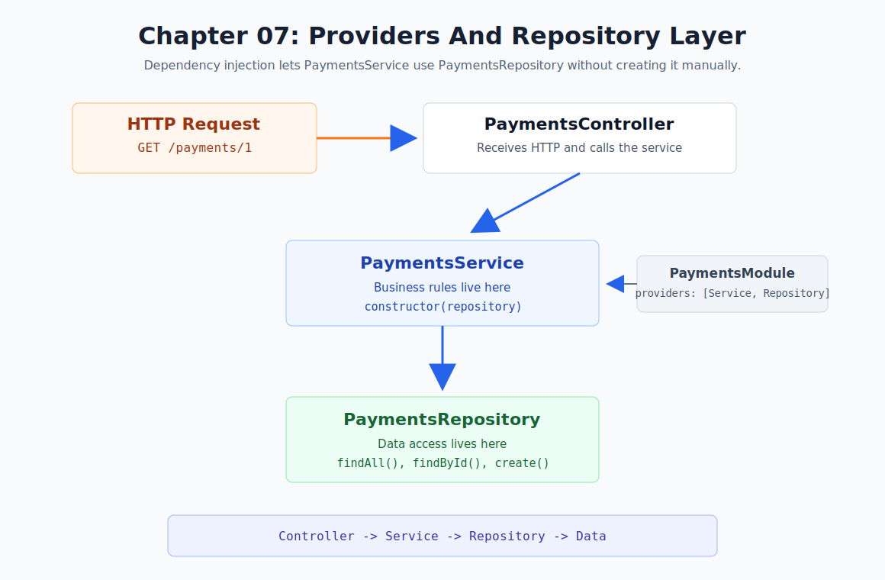

# Chapter 07 - Providers And Repository Layer

[Previous: Chapter 06](chapter-06-http-exceptions.md) | [Course index](README.md) | [Next: Chapter 08](chapter-08-module-boundaries.md)



## Goal

Separate business logic from data access using a repository provider.

```text
PaymentsController
  -> PaymentsService
      -> PaymentsRepository
```

## NestJS Concept

This chapter introduces providers and dependency injection in a more serious architecture shape.

NestJS providers are classes managed by the Nest IoC container. Services and repositories can both be providers. Nest creates them, wires them together, and injects dependencies through constructors.

Official docs: [NestJS Providers](https://docs.nestjs.com/providers)

## Why This Matters

Before this chapter, `PaymentsService` both handled business rules and stored the payment array.

After this chapter:

```text
PaymentsService
  handles business rules
  throws NotFoundException
  delegates data access

PaymentsRepository
  owns the payment array
  finds payments
  creates payments
```

This means a future database chapter can replace repository internals without changing the controller.

## Files

| File | Purpose |
| --- | --- |
| [`src/payments/payments.repository.ts`](../../src/payments/payments.repository.ts) | Stores and retrieves payment data |
| [`src/payments/payments.service.ts`](../../src/payments/payments.service.ts) | Injects the repository and keeps business logic |
| [`src/payments/payments.module.ts`](../../src/payments/payments.module.ts) | Registers `PaymentsRepository` as a provider |

## Repository Provider

```ts
@Injectable()
export class PaymentsRepository {
    private payments = [];

    public findAll(status?: string) {}
    public findById(id: number) {}
    public create(createPaymentDto: CreatePaymentDto) {}
}
```

The repository is a provider because it uses `@Injectable()` and is registered in the module.

## Service Constructor Injection

```ts
constructor(
    private readonly paymentsRepository: PaymentsRepository,
) {}
```

This is dependency injection.

`PaymentsService` does not manually create `PaymentsRepository`. NestJS creates the repository and injects it into the service.

## Module Provider Registration

```ts
@Module({
    controllers: [PaymentsController],
    providers: [PaymentsService, PaymentsRepository],
})
export class PaymentsModule {}
```

This tells NestJS:

```text
PaymentsService is a provider
PaymentsRepository is a provider
PaymentsService can receive PaymentsRepository
```

## Request Flow

```text
Client sends request
PaymentsController handles HTTP
PaymentsController calls PaymentsService
PaymentsService handles business rules
PaymentsService calls PaymentsRepository
PaymentsRepository handles data access
Repository returns data
Service returns result or throws exception
Controller sends response
```

## Test The Same Endpoints

No new route is needed. The API behavior should stay the same while the internal architecture improves.

```http
GET http://localhost:3000/payments
GET http://localhost:3000/payments/1
GET http://localhost:3000/payments?status=paid
GET http://localhost:3000/payments/999
POST http://localhost:3000/payments
```

## Checkpoint

You understand Chapter 07 when you can explain this sentence:

> The service owns business rules, but the repository owns data access.
