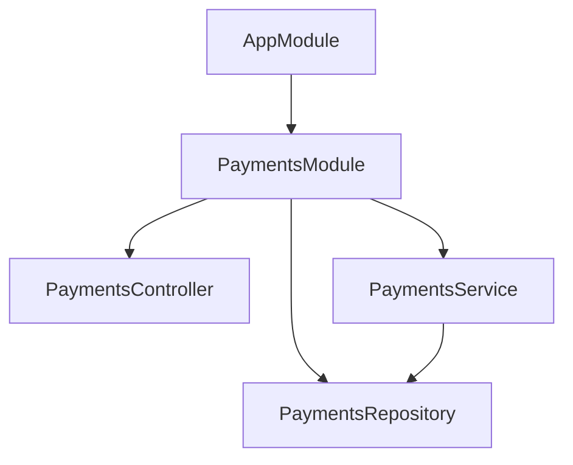

# Chapter 08 - Module Boundaries

[Previous: Chapter 07](chapter-07-providers-repository.md) | [Course index](README.md) | [Next: Chapter 09](chapter-09-custom-providers.md)

## Goal

Learn how modules create boundaries in a NestJS application.

```text
AppModule
  imports PaymentsModule

PaymentsModule
  owns payments controller
  owns payments service
  owns payments repository
```

Official docs: [NestJS Modules](https://docs.nestjs.com/modules)

## Academic Note

A module is not just a folder. It is a boundary.

It answers:

```text
What belongs together?
What is private to this feature?
What should other modules be allowed to use?
```

## Mental Model



## The Four Module Lists

| Metadata | Meaning |
| --- | --- |
| `imports` | Other modules this module needs |
| `controllers` | HTTP entry points owned by this module |
| `providers` | Injectable classes owned by this module |
| `exports` | Providers this module chooses to share |

## Payment System Example

`PaymentsModule` should own:

```text
payments.controller.ts
payments.service.ts
payments.repository.ts
dto/
```

It should not own unrelated concepts like:

```text
users authentication
email sending
database connection setup
global configuration
```

Those deserve their own modules later.

## Common Mistake

Do not put every provider in `AppModule`.

That makes the root module a junk drawer. Feature modules keep the app easier to reason about.

## Checkpoint

You understand Chapter 08 when you can explain this sentence:

> A module is a boundary that groups related controllers and providers, and exports only what other modules should use.
