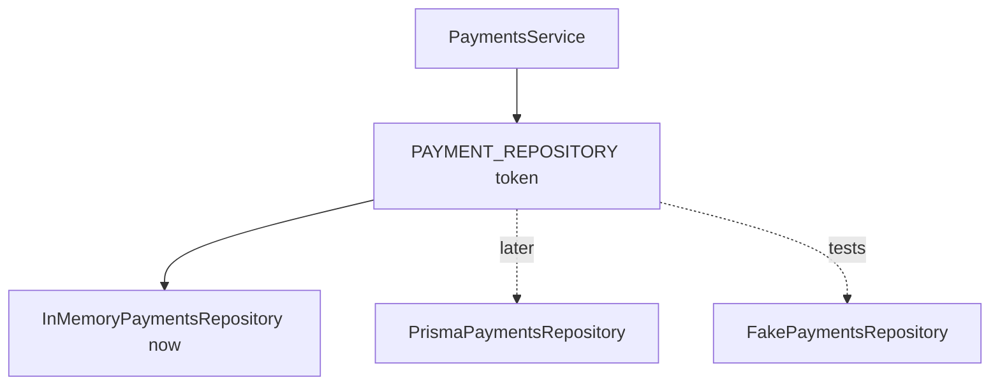

# Chapter 09 - Custom Providers

[Previous: Chapter 08](chapter-08-module-boundaries.md) | [Course index](README.md) | [Next: Chapter 10](chapter-10-middleware.md)

## Goal

Learn why NestJS providers can be registered with tokens instead of only class names.

Official docs: [NestJS Custom Providers](https://docs.nestjs.com/fundamentals/custom-providers)

## Academic Note

Normal provider:

```text
PaymentsService asks for PaymentsRepository
Nest gives PaymentsRepository
```

Custom provider:

```text
PaymentsService asks for PAYMENT_REPOSITORY
Nest decides which implementation to give
```

This matters when the implementation may change.

## Mental Model



## Provider Registration Styles

| Style | Use when |
| --- | --- |
| `useClass` | One class should satisfy a token |
| `useValue` | You want to inject a fixed object, often in tests |
| `useFactory` | Provider needs setup logic before creation |
| `useExisting` | One token should alias another provider |

## Why This Is A Major Topic

Custom providers turn hard dependencies into replaceable dependencies.

This supports:

```text
testing
database migration
feature flags
external service replacement
clean architecture
```

## Payment System Example

Today:

```text
PaymentsRepository stores data in memory
```

Later:

```text
PrismaPaymentsRepository stores data in PostgreSQL
```

The service should not care which one is used.

## Learning Question

Ask this before creating a custom provider:

```text
Do I need to swap this dependency in tests, production, or a future chapter?
```

If yes, a token-based provider may be worth it.

## Checkpoint

You understand Chapter 09 when you can explain this sentence:

> A custom provider separates what a class needs from which implementation it receives.
