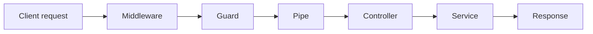

# Chapter 10 - Middleware

[Previous: Chapter 09](chapter-09-custom-providers.md) | [Course index](README.md) | [Next: Chapter 11](chapter-11-guards.md)

## Goal

Learn where middleware fits in the NestJS request lifecycle.

Official docs: [NestJS Middleware](https://docs.nestjs.com/middleware)

## Academic Note

Middleware runs before the request reaches route-specific NestJS features like guards, pipes, and controllers.

It is useful for broad request concerns:

```text
request logging
correlation IDs
basic request enrichment
raw request inspection
```

## Request Lifecycle Position



## What Middleware Should Do

Good middleware is broad and simple.

Examples:

```text
Attach requestId
Log method and URL
Read headers
Block obviously malformed traffic
```

## What Middleware Should Not Do

Avoid putting business logic in middleware.

Bad examples:

```text
Decide payment status
Create invoices
Check complex role permissions
Talk deeply to repository layer
```

Those belong in services or guards.

## Payment System Example

Possible middleware:

```text
PaymentRequestLoggerMiddleware
  logs GET /payments
  logs POST /payments
  adds request timestamp
```

It should not decide whether the payment is valid. DTO validation already handles that.

## Checkpoint

You understand Chapter 10 when you can explain this sentence:

> Middleware is for broad request preparation, not payment business decisions.
