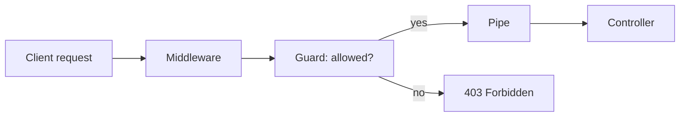

# Chapter 11 - Guards

[Previous: Chapter 10](chapter-10-middleware.md) | [Course index](README.md) | [Next: Chapter 12](chapter-12-interceptors.md)

## Goal

Learn how guards protect routes before controller methods execute.

Official docs: [NestJS Guards](https://docs.nestjs.com/guards)

## Academic Note

A guard answers one question:

```text
May this request continue?
```

It returns:

```text
true  -> controller can run
false -> request is denied
```

## Request Lifecycle Position



## Guard Responsibilities

Good guard decisions:

```text
Is the user authenticated?
Does the user have the required role?
Can this account access this resource?
```

Bad guard decisions:

```text
How should a payment be calculated?
Which database query should run?
How should the response be formatted?
```

## Payment System Example

Later, you might protect payment creation:

```text
POST /payments
  only users with role accountant can create
```

That belongs in a guard, not in a controller `if` statement.

## Learning Distinction

```text
ValidationPipe asks: is the input valid?
Guard asks: is the caller allowed?
Service asks: what should the app do?
```

## Checkpoint

You understand Chapter 11 when you can explain this sentence:

> Guards are authorization gates; they decide whether a request is allowed to reach the handler.
