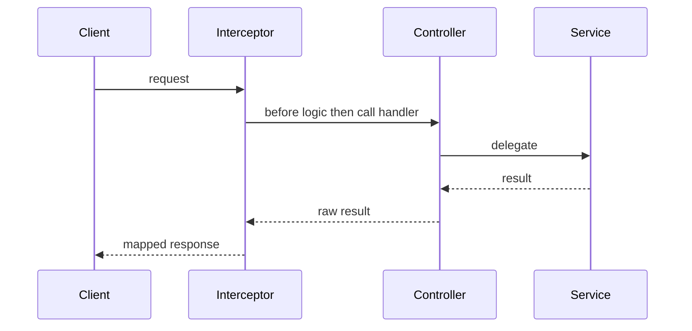

# Chapter 12 - Interceptors

[Previous: Chapter 11](chapter-11-guards.md) | [Course index](README.md) | [Next: Chapter 13](chapter-13-configuration.md)

## Goal

Learn how interceptors wrap controller execution and response flow.

Official docs: [NestJS Interceptors](https://docs.nestjs.com/interceptors)

## Academic Note

An interceptor can run before and after the controller handler.

This makes it useful for:

```text
response formatting
request timing
logging after completion
mapping output shape
catching and mapping errors
```

## Mental Model



## Interceptor Versus Guard

| Concept | Question |
| --- | --- |
| Guard | May the request continue? |
| Interceptor | What should happen around the handler? |
| Pipe | Is input valid or transformed? |
| Filter | How should errors be returned? |

## Payment System Example

A response interceptor could convert:

```json
[
  { "id": 1, "invoiceNo": "BTN-001" }
]
```

into:

```json
{
  "success": true,
  "data": [
    { "id": 1, "invoiceNo": "BTN-001" }
  ]
}
```

That is response shape work, not business logic.

## Checkpoint

You understand Chapter 12 when you can explain this sentence:

> Interceptors wrap the handler; they are excellent for cross-cutting response and timing concerns.
