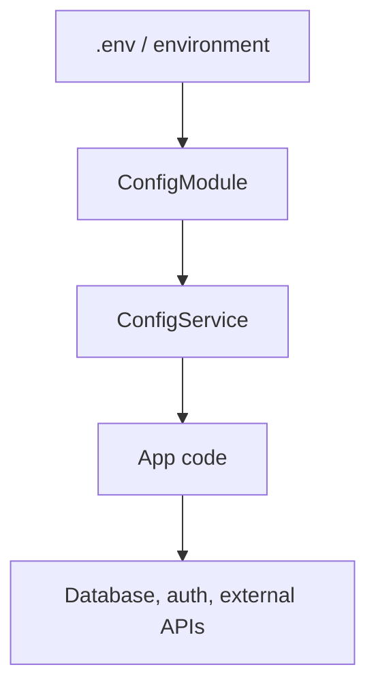

# Chapter 13 - Configuration

[Previous: Chapter 12](chapter-12-interceptors.md) | [Course index](README.md) | [Next: Chapter 14](chapter-14-testing-strategy.md)

## Goal

Learn why production apps should read settings from configuration, not hardcoded values.

Official docs: [NestJS Configuration](https://docs.nestjs.com/techniques/configuration)

## Academic Note

Configuration is how the same code behaves differently across environments.

Examples:

```text
local database URL
production database URL
JWT secret
API port
feature flags
external payment gateway URL
```

## Mental Model



## Why Hardcoding Is A Problem

Hardcoded settings make code:

```text
difficult to deploy
unsafe for secrets
hard to test
easy to accidentally break
```

## Payment System Example

Do not hardcode:

```text
PAYMENT_GATEWAY_URL
DATABASE_URL
JWT_SECRET
PORT
```

Instead, read from configuration.

## Learning Distinction

```text
DTO validates request data
Config validates application settings
Repository uses settings to connect to storage
```

## Checkpoint

You understand Chapter 13 when you can explain this sentence:

> Configuration keeps environment-specific values outside the application logic.
