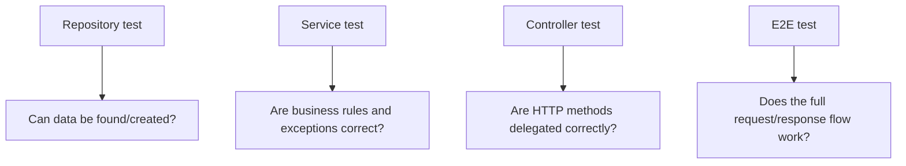

# Chapter 14 - Testing Strategy

[Previous: Chapter 13](chapter-13-configuration.md) | [Course index](README.md)

## Goal

Learn how to think about testing NestJS code without relying only on manual REST Client clicks.

Official docs: [NestJS Testing](https://docs.nestjs.com/fundamentals/testing)

## Academic Note

Testing is not a separate activity after learning. Testing is how you prove your mental model.

For this repo, the most important test question is:

```text
Can I prove each layer does its responsibility?
```

## Test Layers



## Payment System Test Examples

Repository tests:

```text
findAll() returns all payments
findAll("paid") returns only paid payments
findById(999) returns undefined
create(dto) adds a payment
```

Service tests:

```text
findOne("1") returns payment
findOne("999") throws NotFoundException
create(dto) delegates to repository
```

Controller tests:

```text
GET /payments calls service.findAll()
GET /payments/:id calls service.findOne(id)
POST /payments calls service.create(dto)
```

E2E tests:

```text
POST invalid body returns 400
GET missing payment returns 404
GET paid payments returns filtered list
```

## Learning Rule

If a test is hard to write, ask:

```text
Is this class doing too many jobs?
Is a dependency hidden instead of injected?
Is business logic stuck in the controller?
```

## Checkpoint

You understand Chapter 14 when you can explain this sentence:

> Good tests prove responsibilities, not just lines of code.
