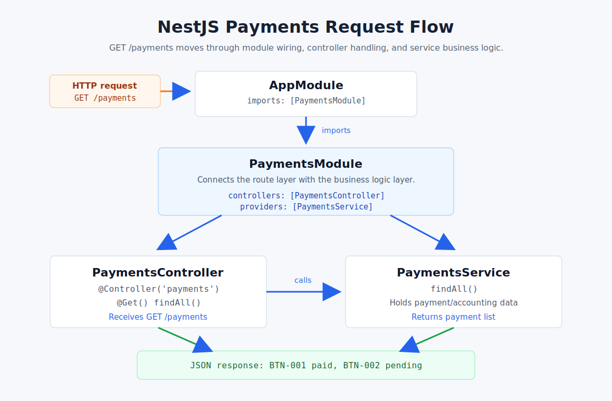

# Payments Flow



## What This Diagram Shows

This is the request flow for:

```http
GET http://localhost:3000/payments
```

## Flow Steps

1. `AppModule` imports `PaymentsModule`.
2. `PaymentsModule` connects `PaymentsController` and `PaymentsService`.
3. `PaymentsController` receives `GET /payments`.
4. `PaymentsService` returns accounting/payment data.

## In Code

```text
src/app.module.ts
  imports: [PaymentsModule]

src/payments/payments.module.ts
  controllers: [PaymentsController]
  providers: [PaymentsService]

src/payments/payments.controller.ts
  @Controller('payments')
  @Get()
  findAll()

src/payments/payments.service.ts
  findAll()
  returns payment list
```

## Tested Endpoint

```http
GET /payments
```

Example response:

```json
[
  {
    "id": 1,
    "invoiceNo": "BTN-001",
    "customer": "Pema Traders",
    "amount": 1500,
    "status": "paid"
  },
  {
    "id": 2,
    "invoiceNo": "BTN-002",
    "customer": "Tashi Store",
    "amount": 2200,
    "status": "pending"
  }
]
```
